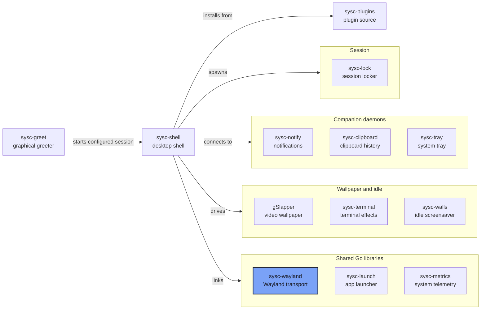

<p align="center">
  <picture>
    <source media="(prefers-color-scheme: dark)" srcset="assets/wordmark.png">
    
  </picture>
</p>

Pure-Go Wayland transport and typed protocol bindings. Core bindings, extension protocols
and a protocol scanner, without CGO or libwayland.

## Quick Links

- [Documentation site](https://nomadcxx.github.io/sysc/docs/components/sysc-wayland/)
- [Documentation](#documentation)
- [The sysc ecosystem](https://github.com/Nomadcxx/sysc-shell/blob/main/docs/ecosystem.md)

## Installation

Run inside an existing Go module with Go 1.26 or later:

```bash
go get github.com/Nomadcxx/sysc-wayland@v0.3.1
```

For the `sessionlock` prerelease, use `go get github.com/Nomadcxx/sysc-wayland@v0.3.2-rc.1`.

Stable packages: `client`, `textinput`, `cursorshape`, `idle`. The prerelease adds `sessionlock`.

## Protocols and transport

Extracted from [dankgo](https://github.com/AvengeMedia/dankgo) at commit `1043465`.
[UPSTREAM.md](UPSTREAM.md) records the source paths and licences.

- **Pure Go, no CGO.** The transport's only non-standard dependency is `golang.org/x/sys/unix`
- **One goroutine owns a connection** and every proxy created from it
- **Wire framing** with ancillary file-descriptor handling across fragmented reads and partial writes
- **Proxy lifecycle** with ID reuse: a server ID replaces a zombie proxy, and a live duplicate panics
- **Generated bindings** for the Wayland core plus `textinput`, `cursorshape` (with tablet-v2),
  `idle`
- **Opcode metadata**: generated types identify events that carry file descriptors
- **Connects** by adopting a `WAYLAND_SOCKET` file descriptor, or using `WAYLAND_DISPLAY`
  (default `wayland-0`), with relative socket names resolved under `XDG_RUNTIME_DIR`

## Releases

| Tag | Adds |
|---|---|
| v0.1.0 | Core transport, proxy lifecycle, generated core bindings |
| v0.2.0 | `textinput` and `cursorshape` |
| v0.2.1 | An object argument in an event no longer registers a proxy |
| v0.2.2 | Coalesced FD ordering and opcode metadata |
| v0.3.0 | `idle` (ext-idle-notify-v1) |
| v0.3.1 | ID reuse fix |

The `sessionlock` package (ext-session-lock-v1) is available on `feat/sessionlock`, tagged
`v0.3.2-rc.1`; it has no stable release yet.

## Generating bindings

The scanner is `cmd/sysc-wayland-scanner`:

```bash
go run ./cmd/sysc-wayland-scanner -i protocols/wayland.xml -o /tmp/sysc-wayland-core.go -pkg client -prefix wl
```

Flags: `-i` input XML, `-o` output Go file, `-pkg` package name, `-prefix`, `-suffix`, and
`-xdg-shell-import` for protocols that reference external `xdg_*` types. The repo ships five XMLs in
`protocols/`. Fetch xdg-shell, fractional-scale and viewporter from wayland-protocols;
wlr-layer-shell comes from wlr-protocols. In-repo invocations are `//go:generate` lines next to each package.

## Development

```bash
go test -race ./...
go vet ./...
go build ./...
go generate ./...   # regenerate bindings with the pinned local scanner
```

Dependency cleanliness check: `go mod tidy && git diff --exit-code -- go.mod go.sum`.

## Ecosystem



[The sysc ecosystem](https://github.com/Nomadcxx/sysc-shell/blob/main/docs/ecosystem.md) explains
each connection, socket and version pin.

## Documentation

- [The sysc ecosystem](https://github.com/Nomadcxx/sysc-shell/blob/main/docs/ecosystem.md)
- [UPSTREAM.md](UPSTREAM.md) — extraction provenance and divergences

## License

BSD-3-Clause. Upstream notices are in [LICENSES/](LICENSES/).

---

<a href="https://github.com/Nomadcxx"></a> — terminal-native tooling for the linux desktop.
[More projects →](https://github.com/Nomadcxx) · [Sponsor](https://github.com/sponsors/Nomadcxx) ❤️
